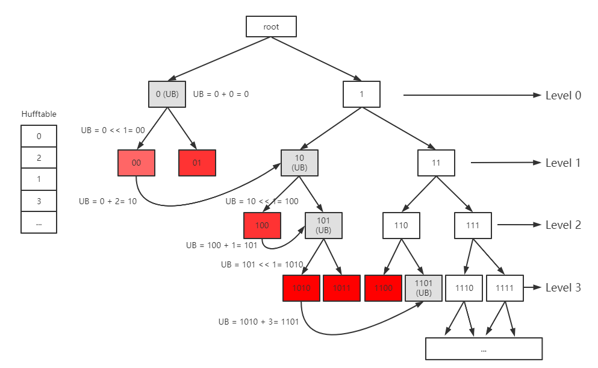

# How to Decode the Huffman Code

## Some Definitions

**Hufftable**: An array stores the number of Huffman code in each level.

**Upper Bound** (UB): The upper bound (excluded) of the largest possible Huffman code in each level.  If a code is less than the upper bound, it must be a Huffman code. If a code is greater or equal to the upper bound, it is not a Huffman code.

Example:

In the Huffman tree below, the upper bound in each level are `0, 10, 101, 1101`.



**How to calculate the UB in each level?**

Initially, `UB = 0`.

When shifting to the next level, `UB = (UB << 1) + Hufftable[n]`, where `n` is the level number.

## How many Huffman codes exist from level 0 to level n?

Since one Huffman code corresponds to one Symbol, we use Symbol Count (**SC**) to denote the number of Huffman code (or symbols) from level `0` to level `n`.

   (Index of hufftable starts from 0)

For example,  `SC[0] = 0, SC[1] = 2, SC[2] = 3, SC[3] = 6` for the Hufftable above.

## How to check if a code (code length = n) is a Huffman code?

By comparing a n-bit code with the **UB** in the `n-1`th level, we can tell if this code is a Huffman code. For example, for a code `11`, we compare it with `UB=10`. We can know that `11` is not a Huffman code since `11 > 10`. For a code `100`, we compare it with `UB = 101`. We can know that `110` is a Huffman code since `100 < 101`.

## How to calculate the index of a Huffman code?

Once we make sure a code (e.g. `100`) is a Huffman code, we calculate the distance (difference) between the code and the UB. `Dis = 101 - 100 = 1`.    

The index of this Huffman code is `Idx = SC[n-1] - Dis`.

Example:

For code `100`, `Dis = 1, Idx = SC[2] - Dis = 3 - 1 = 2`. `Symbol = huffsymbols[2]`. (code `100` is mapped with the `3rd` symbol)

For code `1011`, `Dis = 1101 - 1011 = 2, Idx = SC[3] - Dis = 6 - 2 = 4`. `Symbol = huffsymbols[4]`. (code `1011` is mapped with the `5th` symbol)

## How to decode?

```python
for n = 0:length(code)-1
	level = n;
	code_to_compare = top n bits of code;
	update UB(n);
	update SC(n);
	if code_to_compare < UB:
		calculate Idx;
		symbol = huffsymbols[Idx];
		break;
```
