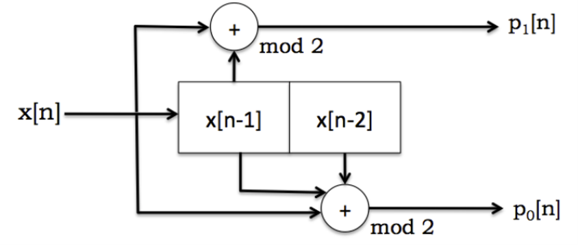
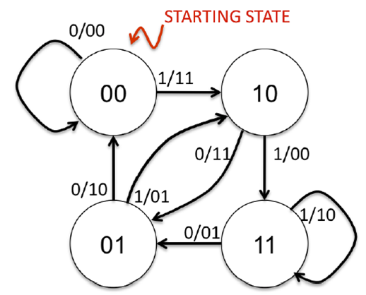
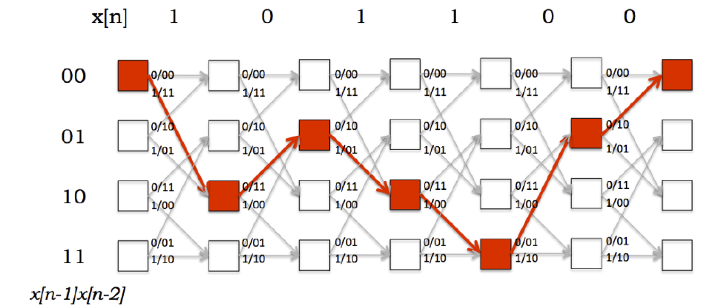
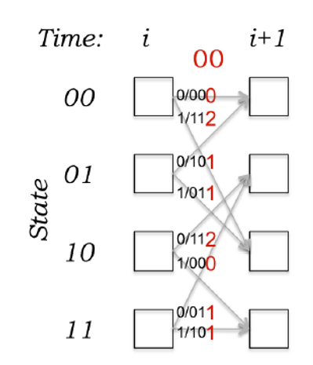

# Viterbi Decoder on FPGA
## 1. Introduction
For this lab, we need to design Viterbi decoder. Viterbi decoder can be used to decode the code encoded by convolutional coding.

### Convolutional Coding
Given a bitstream, we can encode it by performing convolution in a window of length K. The output from each time convolution is carried out is the parity bit. In each clock cycle, we can do r convolutions and get r parity bits.
For example, assume the parity bits are calculated by:
```
p0[n]=x[n]⊕x[n-1]⊕x[n-2]
p1[n]=x[n]⊕x[n-1]
```
In the above case, r=2 since there are two parity bits in each cycle, and `K=3` since the largest length of the convolution window is 3 (from x[n]  to x[n-2]). Note that the “XOR” here is the mod 2 addition.

Suppose a bitstream is 101110, where the leftmost bit is the earliest bit (x[0]). We assume x[-1] and x[-2] are 0, then the first two parity bits (p0[0] and p1[0]) are 1 each, which gives 11. The second is 11, the third is 01, all the way to the sixth, which is 01. Therefore, the length of the output encoding code is r ×length(input bitstream).

### Viterbi encoder
Given an encoded bitstream, Viterbi decoder is employed to decode it. First, we need to find a reliable way to represent our encoding system. For the encoding example detailed above, we can represent it by the circuit shown in the figure below. In this design, there are two registers saving `x[n-1]` and `x[n-2]`.



Besides, we can also represent the encoding system using a finite state machine as shown in the figure below. The two-bit number in each state represents the values stored in the registers (`x[n-1]` and `x[n-2]`), with the leftmost bit representing the most recent bit (`x[n-1]`).  
The length of the bits in each state is `K-1`. Each `x/yy` on edge represents that if the next bit is `x`, the parity bits output is `yy`. The length of the bits of `yy` is `r`.



### Viterbi decoder
There is a structure called Trellis as shown in the figure below. In a column, the four nodes (squared boxes) represent all four states (`00`, `01`, `10`, `11`) in a cycle. Each column represents a cycle. And the arrows between columns represents the transition between the states. This structure describes the change of states each time a bit (`x[n]`) is given as input. In the example, the output bitstream (`yy`) here is `111101000110`.  



To decode, given an encoded bitstream, we need to find out the path in Trellis which has the highest probability (lowest error) to generate the encoded bitstream.

There are three steps to decode in the Trellis structure:  
The first step is to calculate the branch metrics. For each `r` bits of the encoded bitstream, an error is calculated between itself and the output (`yy`) of each edge present in one column of the Trellis structure. This error is the Hamming distance. An example is shown in the figure below.



In the example above, the two-bit value of the encoded bitstream (parity bits) is `00`. Each grey arrow represents a state transition from cycle `i` to `i+1`. The red number is the Hamming distance between the parity bits `00` and the outputs of the state maching. There are two edges that can perfectly fit it with 0 error, which are edges `00 -> 00` and `10 -> 11`. In the Trellis diagram, you need to calculate the errors for 48 times in total (6 pairs of encoded bits times 8 Hamming distances in each column). If the encoded stream is `11 11 01 00 01 10`, then you need to calculate the errors using `11` with all 8 outputs in the first column, the errors using `11` with all 8 outputs in the second column, … until the last pair `10` with all 8 outputs of the last column.

The second step is to calculate the least error on each node (Path Metrics) in Trellis. Since we assume initially, all the registers are 0 (`x[-1] = 0`, `x[-2] = 0`), we set the error of the state `00` in the first column to `0` and all the other nodes in the first column as `∞`. Besides, all the errors of other nodes in Trellis are set as `∞`. Next, starting from the second column, we check each edge between column `i-1` and column `i`. If there is an edge `e` from a node `m` in column `i-1` and a node `n` in column `i`, and `error(m) + error(e) < error(n)`, then we do an update `error(n) = error(m) + error(e)`, and save the best edge `e` for node `n`.

The third step is, starting from the last column, always find the node with least error, and backtrack all the way to the first column. When backtracking one edge, the input of the edge is saved (for instance, if an edge is `1/10`, the input is `1`), and the decoded bitstream is in the reversed order of the saved edge inputs.

In this lab, we will implement the Viterbi decoder with `r = 2` and `K = 3`.
## 2. Lab Design on Viterbi Decoder
In this section, we need to implement the Viterbi module in Vivado. Before you proceed, please download “Lab6_student_code.zip” from Piazza and extract it. After extraction, you will get a folder named as “Lab6_student_code/”.

Copy the folder “base_vivado” and rename it as “lab6_vivado”. From the source panel, remove unnecessary source files from lab5. Open the project by double-click on “lab6_vivado/base/base.xpr”.

Add all the source files to the project from “Lab6_student_code/” and implement your design in "viterbi.v" according to Section 1.

You are required to design Viterbi decoder with `r=2` and `K=3`. The length of the input code length `10`, thus, the length of the output code length is `5`.

In “viterbi.v”, `codein` is the input code which needs to be decoded. The highest `r` bits (bit 9 to bit 8) are the earliest bits (p0[0],p1[0]). The `state_out` input contains information about the state output given the input. The structure of it is: `[the output when inputting 1 at state 11][the output when inputting 0 at state 11] [the output when inputting 1 at state 10][the output when inputting 0 at state 10] [the output when inputting 1 at state 01][the output when inputting 0 at state 01][the output when inputting 1 at state 00][the output when inputting 0 at state 00]`, with each “[]” denoting `r` bits. The highest bit in the state representation here is the latest bit (`x[n-1]`). For example, if current state is `10`, the input is `1`, then, the next state is `11` but not `01`.

You are required to write Verilog code such that:  
When `rst` is `0`, `finish` is set to `0`.  
When `rst` is `1`, the module starts calculating.  
The decoded bitstream is finally put at the output port `codeout`. The first data is the earliest bit (`x[0]`).  
When the `codeout` is ready, `finish` is set to `1`, and both `codeout` and `finish` are required to  hold their values.

After you designed the decoder, run simulation based on “viterbi_tb.v”. You should see the decoded bitstream.

## 3. Implementation on the FPGA
In this section, we will implement the design on the FPGA.  
- Right click “top_viterbi.v” in the “source” panel and click “set as top” (If this file is already in bold font, it is already the top module).   
- Now, “top_viterbi.v” needs a dual port RAM. We add the RAM for “top_viterbi.v”. On the left panel, click IP catalog, on the top right corner, search “ram”. Double click “block memory generator”.
- If there is a window popped up, asking if you want to add IP to block design or customize IP, choose "customize IP".
- For memory type, select “True Dual Port Ram”.
- In both port A and port B options, change write width to 8, and write depth to 65536.
- Operation mode “Read First”, enable port type “Always Enabled”. Click “ok”.
- In the pop-up window, select “Global” in the synthesis option, and click “generate”.
- Now, click generate bitstream. After the bitstream is generated, click file->export->export hardware. Check include bitstream, click “ok”.
- Please launch SDK and generate the boot image (BOOT.bin) as in the previous lab with one exception:
Use the bitstream file base/base.sdk/top_viterbi_hw_platform_0/top_viterbi.bit.
- Copy the updated BOOT.bin and lab6_viterbi_test into your SD card, boot the FPGA and run the test with command:
`./lab6_viterbi_test`
- Take a screen shot of the terminal when the result shows.  
- Unmount the SD card, exit the serial communication and turn off your FPGA.

Some commonly used commands:  
```
mount /dev/mmcblk0p1 /mnt/
cd /mnt/
insmod transfpga.ko
mknod /dev/transfpga c 245 0
./lab6_viterbi_test
cd /
umount /mnt/
```

## 4. Question
- Is Viterbi Decoder guaranteed to decode the original data correctly? Why?

## 5. Pre-lab Submission
- Please only submit one PDF file, containing your answers to the question in the previous section.  
- Please name the PDF file as "Lab#_Prelab_Section#_LastName_FirstName.pdf".  
- Please submit the PDF file on Canvas before March 21 (Monday) 11:59 pm.  


## 6. Post-lab Submission
- Please only submit one PDF file, containing the following items:  
    - Screenshots of the terminal after running the command `./lab6_viterbi_test`  
    - A few words explaining the results
    - Screenshots of your code in this design
- Please name the PDF file as "Lab#_Postlab_Section#_LastName_FirstName.pdf".  
- Please submit the PDF file on Canvas before March 25 (Friday) 11:59 pm.  
