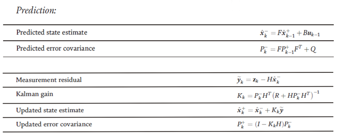

# Kalman Filter on FPGA
## 1. Introduction
For this lab, we need to design the Kalman filter.  
Kalman filter estimates the state of a system based on the input and observation of the system. Assume we have a linear system represented by:  
$$
x_k = F x_{k-1} + Bu_{k-1} + w_{k-1}
$$  
, where $$F$$, $$B$$ are the square matrices of size `n`. $$u_{k-1}$$ is the input control vector of size `n`. $$w_{k-1}$$ is the noise input vector. 
The noise input follows the normal distribution with covariance $$Q$$.    
$$w_{k-1}\sim N(0,Q)$$  
We want to estimate the state vector of the system `x`, which is not known directly.   
What we know are the input of the sytem `u` and an obervation of the state vector: `z`. The relationship of `z` and `x` can be illustrated as:
$$  
w_{k-1}\sim N(0,Q)
$$  
, where `H` is a `n`-dimensional square matrix, and `v[k]` is the observation noise vector. `v[k]` also follows the normal distribution with covariance `R`.

Now we have an estimation system, where we have two known inputs `u[k]` and `z[k]`. And the estimated `x[k]` is the output. The estimation process is shown in the figure below.


For this lab, we use vehicle position as an example. Assume the state $$x=\begin{bmatrix}p\\ v\end{bmatrix}$$, where $$p$$ is the position of the vehicle and $$v$$ is the velocity. Both $$p$$ and $$v$$ are scalars. Also, assume $$u$$ is the acceleration. Then, $$F=\begin{bmatrix} 1 & ∆t \\ 0 & 1 \end{bmatrix}$$, $$B=\begin{bmatrix} 0.5{\Delta t}^2 \\ 1\end{bmatrix} $$. Assume the measurement $$z$$ is $$x$$ itself with noise, then $$H=\begin{bmatrix} 1 & 0 \\ 0 & 1\end{bmatrix} $$.  
In this lab, we assume both $$Q$$ and $$R$$ are $$\begin{bmatrix} 0.2 & 0 \\ 0.2 & 0\end{bmatrix} $$, and the initial state $$x_0 = \begin{bmatrix} 0 \\ 0\end{bmatrix} $$, and $$P_0=\begin{bmatrix} 0 & 0 \\ 0 & 0\end{bmatrix} $$.

## 2. Lab Design on Viterbi Decoder
In this section, we need to implement the Kalman filter module in Vivado. Before you proceed, please download **"Lab7_student_code.zip"** from Piazza and extract it. After extraction, you will get a folder named as **"Lab7_student_code/"**.

Copy the folder **"base_vivado"** and rename it as **"lab7_vivado"**. From the source panel, remove unnecessary source files. Open the project by double-click on **"lab7_vivado/base/base.xpr"**.

In this lab, you need to use **16-bit signed fixed-point** number for calculation, with **10 bits** for the fractional part.  

- In **"kalman.v"**, `n` is an input indicate this is the `nth` input. `u` and `z` are the acceleration and the measurement respectively. The metrics `n`, `u`, `z` will be updated on each positive edge of `clk`, i.e., for each positive edge of the clock, there is a set of new input. You are not required to use all the inputs, but the input would be continuously sent. `x0`, `P0` are the initial states. The output `n_0` indicates the output calculated from `n_0th` input. The estimated state is `x0` and `outen` indicates if there is output in this corresponding clock cycle. 

- Your system may have latency and/or delay. For example. If your system has a latency of 10 clock cycles and a delay of 4 clock cycles, your system may use the input at clock cycles 0, 10, 20 …, and output the results at the respective clock cycles of  14, 24, 34… and so on. However, output n_0 needs to indicate which input is used for calculating this output. Therefore, in the above example, at the clock cycles 14, 24, 34, n_0 should be 0, 10, 20…

- There will be totally 1000 input data elements, which will be input within 1000 clock cycles. You are required to have at least 5 (10 for GRADUATE students) outputs within 1000 clock cycles. Therefore, your design should not have large latency and delay. For example, if the latency of your design is 400, which means your design needs 400 clock cycles to filter one input, then you can only generate 2 filtered data output, and this is not sufficient. 

- You are required to implement the design such that:
  - When `rst` is `0`, all the data elements are reset to `0` and `outen` is set to `0`.
  - When `rst` is `1`, the module starts sampling and calculating.
  - Whenever there is an output on `n_0` and `x_0`, `outen` is set to `1`. Otherwise, `outen` is set to `0`. For each output, `outen` is only set to `1` for `1` clock cycle. 

## 3. Implementation on the FPGA
In this section, we will implement the design on the FPGA.  
- Right click **"top_kalman.v"** in the **"source"** panel and click **"set as top"** (If this file is shown in bold font, it is already the top module).   

- The block RAM settings for this lab is shown in the table below.
  
    | Block RAM Name | Memory Type |    Port A Settings | Port B Settings|
    | ------------- | ------------- | ------------- | ------------- |
    | blk_mem_gen_0  | True Dual Port  | Width: 8, Depth: 20000, Read First, Always Enabled  | Same as Port A  |
    | blk_mem_gen_1  | Single Port RAM  | Width: 96, Depth: 1000, Read First, Always Enabled  | N/A  |
    | blk_mem_gen_2  | Single Port RAM  | Width: 32, Depth: 1000, Read First, Always Enabled  | N/A  |

- Click on **"Generate Bitstream"** to invoke the design flow and generate the bitstream. After the bitstream is generated, click **"File -> Export -> Export Hardware"**. Check the box **"Include Bitstream"**, click **"OK"**.
- Please launch SDK and generate the boot image (**BOOT.bin**) as in the previous lab with one exception:
    Use the bitstream file **base/base.sdk/top_viterbi_hw_platform_0/top_viterbi.bit**.
- Copy the updated **BOOT.bin**, **lab7_data** and **lab7_kalman_test** into your SD card, boot the FPGA and run the test with command:
    ```  
    ./lab7_kalman_test [Clock cycles between each sampling]
    // For example:
    ./lab7_kalman_test 10
    ```  
- You may need to adjust your sampling rate for a better results.
- Take a screen shot of the terminal when the result shows.
- Unmount the SD card, exit the serial communication and turn off your FPGA.

- Some commonly used commands:  
    ```
    picocom -b 115200 -r -l /dev/ttyUSB1
    mount /dev/mmcblk0p1 /mnt/
    cd /mnt/
    insmod transfpga.ko
    mknod /dev/transfpga c 245 0
    ./lab7_kalman_test [Clock cycles between each sampling]
    cd /
    umount /mnt/
    ```

## 4. Matrix Operations
In this lab, most of the operations involved are matrix multiplication and inversion. As a warm-up, you are asked to write a testbench to test the functionality of the module `matmul` and `divider`. Please refer to the test benches in the previous labs, write a test bench that satisfies the following functionalities:
Suppose we have 
$$
A = \begin{bmatrix} 1 & 2 \\ 3 & 4\end{bmatrix}
B = \begin{bmatrix} 0.5 & 0 \\ 0 & 1.5\end{bmatrix}
x = \begin{bmatrix} 0.5 \\ 1.5\end{bmatrix}
$$
- Calculate the result $$A \times B$$ with the module `matmul`.
- Calculate the result $$A \times x$$ with the module `matmul`.
- Calculate the result of equation $$\frac{1}{2.0}\end{bmatrix}$$ with the module `divider`.  

Please include the screenshots the simulation results, and verify if the results are correct. Remember that we are using **16-bit signed fixed-point** numbers for the calculation, with **10 bits** for the fractional part.  

## 5. Pre-lab Submission
- Please only submit one PDF file, containing your work in Section 4.   
- Please name the PDF file as "Lab#_Prelab_Section#_LastName_FirstName.pdf".  
- Please submit the PDF file on Canvas before March 28 (Monday) 11:59 pm.  


## 6. Post-lab Submission
- Please only submit one PDF file, containing the following items:  
    - Screenshots of the terminal after running the command `./lab7_kalman_test [Clock cycles between each sampling]`  
    - A few words explaining the results
    - Screenshots of your code in this design
- Please name the PDF file as "Lab#_Postlab_Section#_LastName_FirstName.pdf".  
- Please submit the PDF file on Canvas before March 31 (Friday) 11:59 pm.  


[anotherpage](./../../another-page.md)

$$E=mc^2$$