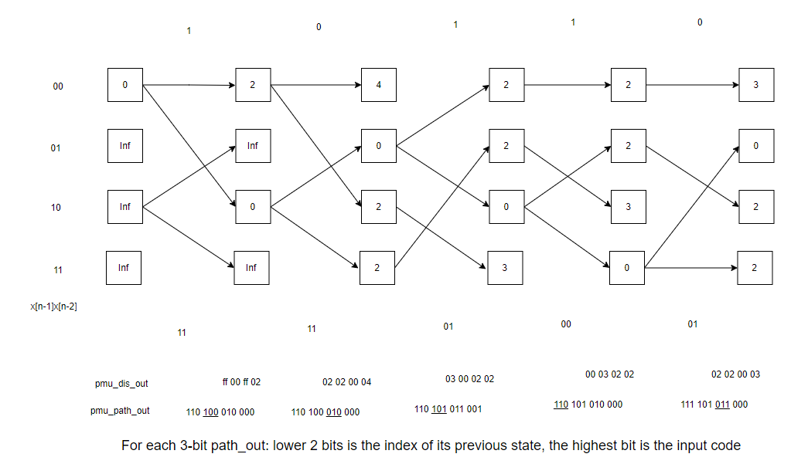

# Kalman Filter on FPGA
## 1. Introduction
For this lab, we need to design the Kalman filter.  
Kalman filter estimates the state of a system based on the input and observation of the system. Assume we have a linear system represented by:  
$$
x_k = F x_{k-1} + Bu_{k-1} + w_{k-1}
$$  
, where $$F$$, $$B$$ are the square matrices of size `n`. $$u_{k-1}$$ is the input control vector of size `n`. $$w_{k-1}$$ is the noise input vector. 
The noise input follows the normal distribution with covariance $$Q$$.    
$$w_{k-1}\sim N(0,Q)$$  
We want to estimate the state vector of the system `x`, which is not known directly.   
What we know are the input of the sytem `u` and an obervation of the state vector: `z`. The relationship of `z` and `x` can be illustrated as:
$$  
w_{k-1}\sim N(0,Q)
$$  
, where `H` is a `n`-dimensional square matrix, and `v[k]` is the observation noise vector. `v[k]` also follows the normal distribution with covariance `R`.

Now we have an estimation system, where we have two known inputs `u[k]` and `z[k]`. And the estimated `x[k]` is the output. The estimation process is shown in the figure below.


For this lab, we use vehicle position as an example. Assume the state $$x=\begin{bmatrix}p\\ v\end{bmatrix}$$, where $$p$$ is the position of the vehicle and $$v$$ is the velocity. Both $$p$$ and $$v$$ are scalars. Also, assume $$u$$ is the acceleration. Then, $$F=\begin{bmatrix} 1 & ∆t \\ 0 & 1 \end{bmatrix}$$, $$B=\begin{bmatrix} 0.5{\Delta t}^2 \\ 1\end{bmatrix} $$. Assume the measurement $$z$$ is $$x$$ itself with noise, then $$H=\begin{bmatrix} 1 & 0 \\ 0 & 1\end{bmatrix} $$.  
In this lab, we assume both $$Q$$ and $$R$$ are $$\begin{bmatrix} 0.2 & 0 \\ 0.2 & 0\end{bmatrix} $$, and the initial state $$x_0 = \begin{bmatrix} 0 \\ 0\end{bmatrix} $$, and $$P_0=\begin{bmatrix} 0 & 0 \\ 0 & 0\end{bmatrix} $$.

## 2. Lab Design on Viterbi Decoder
In this section, we need to implement the Kalman filter module in Vivado. Before you proceed, please download **"Lab7_student_code.zip"** from Piazza and extract it. After extraction, you will get a folder named as **"Lab7_student_code/"**.

Copy the folder **"base_vivado"** and rename it as **"lab7_vivado"**. From the source panel, remove unnecessary source files. Open the project by double-click on **"lab6_vivado/base/base.xpr"**.

In this lab, you need to use **16-bit signed fixed-point** number for calculation, with **10 bits** for the fractional part.  

You are required to design Viterbi decoder with `r=2` and `K=3`. The length of the input code length `10`, thus, the length of the output code length is `5`.

In `viterbi.v`, `codein` is the encoded bitstream which needs to be decoded. The highest `r` bits (bit `9` to bit `8`) are the earliest two parity bits (`p0[0]`,`p1[0]`).  
The `states` input contains information about the state output (`yy`) given the input (`x`).  
The structure of it is:  
`[yy | x = 1, state = 11][yy | x = 0, state = 11] [yy |  x = 1, state = 10][yy | x = 0, state = 10] [yy | x = 1, state = 01][yy | x = 0, state = 01][yy | x = 1, state = 00][yy | x = 0, state = 00]`    
, with each `[]` denoting `r` bits.  
For the two-bit value denoting the states, the highest bit here denotes the latest bit (`state = x[n-1]x[n-2`). For example, if the current state is `10`, and the input is `1`, then, the next state is `11`.

You are required to write Verilog code such that:  
- When `rst` is `0`, `finish` is set to `0`.  
- When `rst` is `1`, the module starts decoding.  
- The decoded bitstream is finally put at the output port `codeout`. The first data is the earliest bit (`x[0]`).  
- When the `codeout` is ready, `finish` is set to `1`, and both `codeout` and `finish` are required to  hold their values.

After you designed the decoder, run simulation based on “viterbi_tb.v”. You should see the decoded bitstream.  
The figure below shows the outputs of PMU corresponding to the inputs in the test bench.  


## 3. Implementation on the FPGA
In this section, we will implement the design on the FPGA.  
- Right click “top_viterbi.v” in the “source” panel and click “set as top” (If this file is already in bold font, it is already the top module).   
- Now, “top_viterbi.v” needs a dual port RAM. We add the RAM for “top_viterbi.v”. On the left panel, click IP catalog, on the top right corner, search “ram”. Double click “block memory generator”.
- If there is a window popped up, asking if you want to add IP to block design or customize IP, choose "customize IP".
- For memory type, select “True Dual Port Ram”.
- In both port A and port B options, change write width to 8, and write depth to 65536.
- Operation mode “Read First”, enable port type “Always Enabled”. Click “ok”.
- In the pop-up window, select “Global” in the synthesis option, and click “generate”.
- Now, click generate bitstream. After the bitstream is generated, click file->export->export hardware. Check include bitstream, click “ok”.
- Please launch SDK and generate the boot image (BOOT.bin) as in the previous lab with one exception:
Use the bitstream file base/base.sdk/top_viterbi_hw_platform_0/top_viterbi.bit.
- Copy the updated BOOT.bin and lab6_viterbi_test into your SD card, boot the FPGA and run the test with command:
`./lab6_viterbi_test`
- Take a screen shot of the terminal when the result shows.  
- Unmount the SD card, exit the serial communication and turn off your FPGA.

Some commonly used commands:  
```
mount /dev/mmcblk0p1 /mnt/
cd /mnt/
insmod transfpga.ko
mknod /dev/transfpga c 245 0
./lab6_viterbi_test
cd /
umount /mnt/
```

## 4. Question
- Is Viterbi Decoder guaranteed to decode the original data correctly? Why?

## 5. Pre-lab Submission
- Please only submit one PDF file, containing your answers to the question in the previous section.  
- Please name the PDF file as "Lab#_Prelab_Section#_LastName_FirstName.pdf".  
- Please submit the PDF file on Canvas before March 21 (Monday) 11:59 pm.  


## 6. Post-lab Submission
- Please only submit one PDF file, containing the following items:  
    - Screenshots of the terminal after running the command `./lab6_viterbi_test`  
    - A few words explaining the results
    - Screenshots of your code in this design
- Please name the PDF file as "Lab#_Postlab_Section#_LastName_FirstName.pdf".  
- Please submit the PDF file on Canvas before March 25 (Friday) 11:59 pm.  


[anotherpage](./../../another-page.md)

$$E=mc^2$$