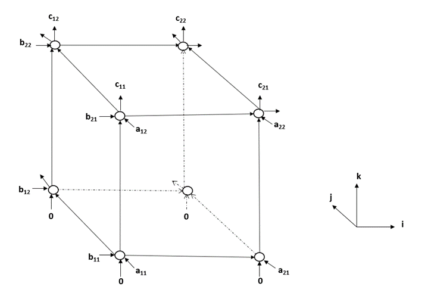
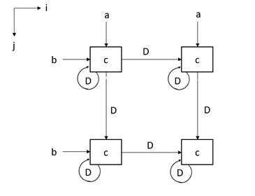

## 1. Introduction
In this lab we need to design systolic arrays for matrix multiplication. Systolic arrays are data processing units arranged in mesh-like topologies. The data processing units or nodes perform sequence of operations on the data that flows through them. The simplest design of a systolic array in a 3D representation is shown in the figure below. This systolic array can calculate the multiplication of two $$2 \times 2$$ matrices $$a$$ and $$b$$, and the result is matrix $$c$$, such that $$c=a \times b$$.  
  

The systolic array can be modified to a 2D structure as well, and this is shown in the figure below.  
  
To compute $$c=a \times b$$, the numbers in matrice $$a$$ and $$b$$ need to be input in the two ports for $$a$$ and two ports for $$b$$ in the correct order and with correct delay. 

## 2. Lab Design on Systolic Arrays
In this section, we need to implement the systolic array module in Vivado. Before you proceed, please download **"Lab8_student_code.zip"** from Piazza and extract it. After extraction, you will get a folder named as **"Lab8_student_code/"**. Copy the folder **"base_vivado"** and rename it as **"lab8_vivado"**. From the source panel, remove unnecessary source files. Open the project by double-click on **"lab8_vivado/base/base.xpr"**.

In this lab, we will implement the 3-D systolic array design in **"systolicarray_1.v"**, and the 2-D systolic array design in **"systolicarray_2.v"**. Please use **8-bit signed fixed-point** number for calculation, with **4 bits** for the fractional part.  

In this lab, all the matrices in the sequential form are arranged column by column, and then row by row. For example, if a matrix $$m$$ has 3 rows and 2 columns, we will have an array to save this matrix as $$\lbrack m_{32}, m_{31}, m_{22}, m_{21}, m_{12}, m_{11} \rbrack$$ ,where $$m_{ij}$$ refers to data at row $$i$$ and column $$j$$ of the matrix $$m$$.  

- In **"systolicarray_1.v"**,$$mi0$$, $$mi1$$ are two inputs representing the two matrices. The output matrix is $$mor$$, resulting from the operation $$mi0 \times mi1$$. You are required to design the combinational logic between $$mi0$$, $$mi1$$ and $$mo$$, where $$mo$$ is the output result from operation $$mi0 \times mi1$$ of the combinational logic.  
- Please write a testbench **"systolic_array_tb.v"** to calculate the  
  $$
  \begin{bmatrix} 0.5 & 1 \\ 1 & 0.5\end{bmatrix} \times \begin{bmatrix} 1 & 2 \\ 3 & 4\end{bmatrix}
  $$  
  Run the behavioral simulation and take a screenshot of the result. Please include it in the pre-lab submission with explanation on the result.

- For the 2-D design of the systolic array, please implement it in **"systolicarray_2.v"**. Please pay attention to stream in the entries of the two input matrices in the correct order. After the design, please use the same test bench file to do the same matrix calculation, and include the screenshot in your post-lab submission.  

## 3. Implementation on the FPGA
In this section, we will implement the design on the FPGA.  
- Right click **"top_sysarr.v"** in the **"source"** panel and click **"set as top"** (If this file is shown in bold font, it is already the top module).   

- The block RAM settings for this lab is shown in the table below.
  
    | Block RAM Name | Memory Type |    Port A Settings | Port B Settings|
    | ------------- | ------------- | ------------- | ------------- |
    | blk_mem_gen_0  | True Dual Port  | Width: 8 Depth: 65536 Read First Always Enabled  | Same as Port A  |  

- Click on **"Generate Bitstream"** to invoke the design flow and generate the bitstream. After the bitstream is generated, click **"File -> Export -> Export Hardware"**. Check the box **"Include Bitstream"**, click **"OK"**.
- Please launch SDK and generate the boot image (**BOOT.bin**) as in the previous lab with one exception:  
    Use the bitstream file **base/base.sdk/top_viterbi_hw_platform_0/top_systolicarray.bit**.
- Copy the updated **BOOT.bin** and **lab8_sysarr_test** into your SD card, boot the FPGA and run the test with command:
    ```  
    ./lab8_sysarr_test  
    ```  
- Take a screen shot of the terminal when the result shows.
- Unmount the SD card, exit the serial communication and turn off your FPGA.

- Some commonly used commands:  
    ```
    picocom -b 115200 -r -l /dev/ttyUSB1
    mount /dev/mmcblk0p1 /mnt/
    cd /mnt/
    insmod transfpga.ko
    mknod /dev/transfpga c 245 0
    ./lab8_sysarr_test 
    cd /
    umount /mnt/
    ```

## 4. Pre-lab Submission
- Please only submit one PDF file, containing your code and simulations for the 3-D systolic array design.   
- Please name the PDF file as "Lab#_Prelab_Section#_LastName_FirstName.pdf".  
- Please submit the PDF file on Canvas before April 4 (Monday) 11:59 pm.  


## 5. Post-lab Submission
- Please only submit one PDF file, containing the following items:  
    - Screenshots of the behavioral simulation of the 2-D systolic array design  
    - Screenshots of the terminal after running the command `./lab8_sysarr_test  
    - A few words explaining the results
    - Screenshots of your code in this design
- Please name the PDF file as "Lab#_Postlab_Section#_LastName_FirstName.pdf".  
- Please submit the PDF file on Canvas before April 8 (Friday) 11:59 pm.  

