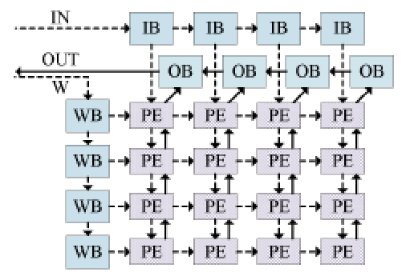
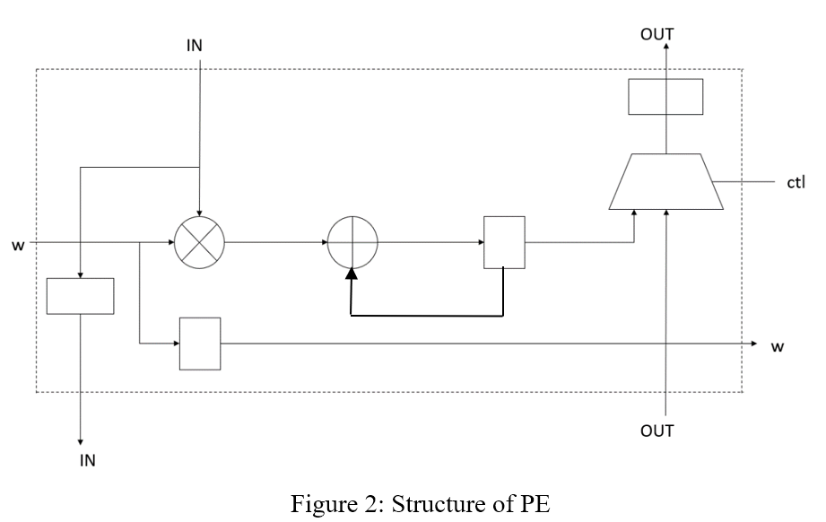
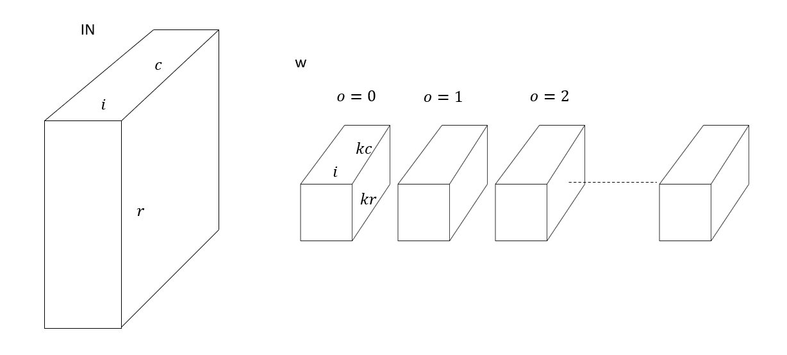
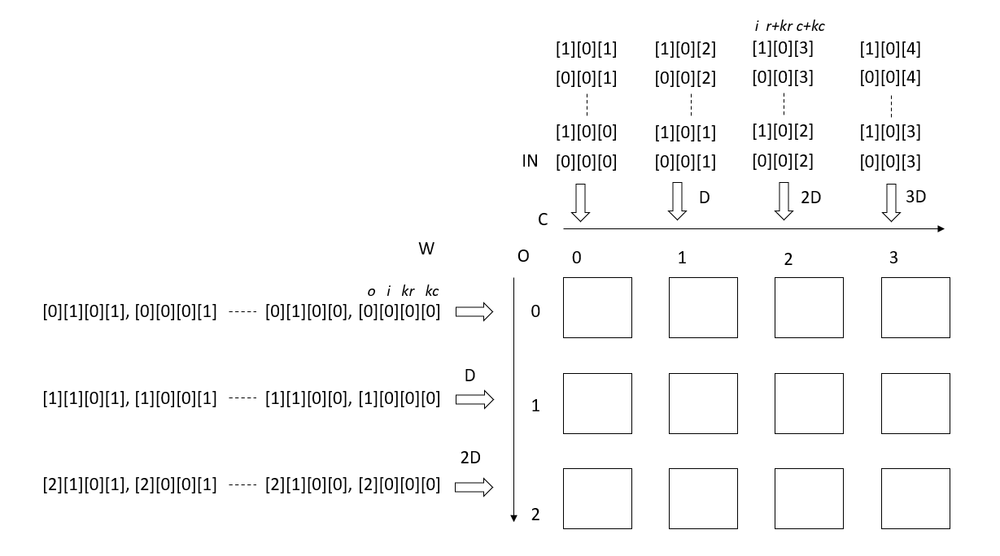
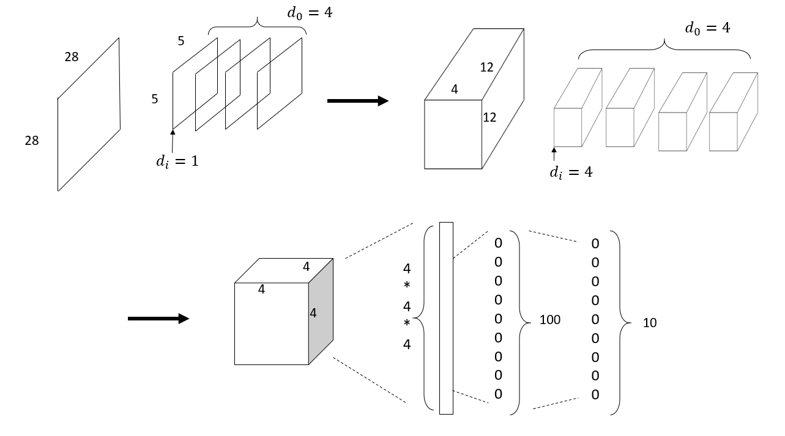
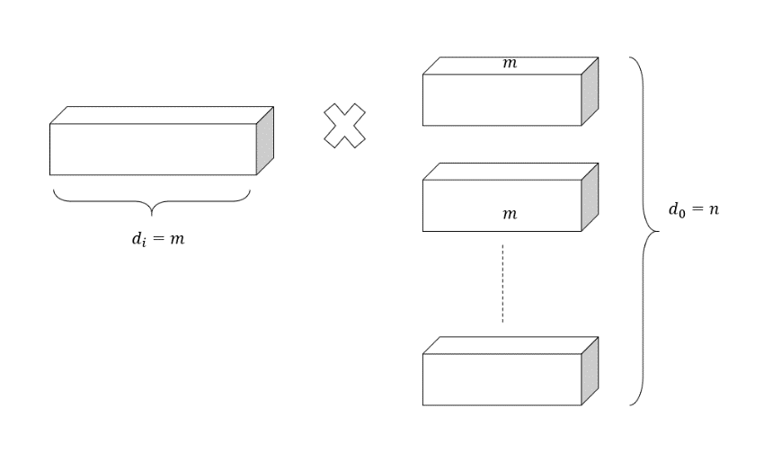
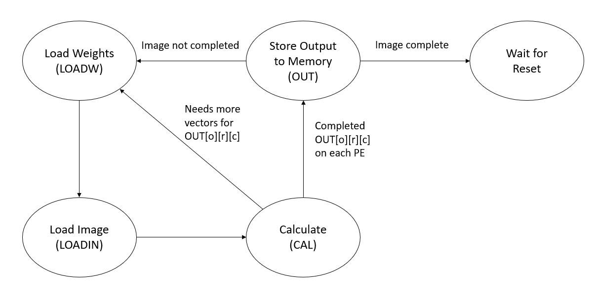

## 1. Introduction
In this lab, we will design systolic arrays for convolutional neural networks (CNN). We will first learn the architecture of PE (Processing Element) and the structure of the systolic array. Then, we will learn the scheduling in the convolutional computation. Finally, we will learn about the complete CNN design.   

### 1.1 Structure of systolic arrays
The structure discussed here is similar to the one described by authors *Xuechao Wei, Cody Hao Yu, Peng Zhang, Youxiang Chen, Yuxin Wang, Han Hu, Yun Liang, and J. Cong* in the paper, **“Automated Systolic Array Architecture Synthesis for High Throughput CNN Inference on FPGAs”** published in 2017 at the  *54th ACM/EDAC/IEEE Design Automation Conference (DAC), pp. 1–6*.  
  
In the , the terms **WB**,**IB**,**OB** refer to the weight buffers, input buffers and output buffers. PE (Processing Element) is the basic unit similar to Lab8. Its structure in this lab is shown in the figure below.  
  

### 1.2 Convolution calculation
For each layer of the CNN, we need to do the convolution. The pseudo-code is as follows:
```
for (o = 0; o < do; o++) {
  for (i = 0; i < di; i++) {
    for (c = 0; c <= dc - dkc - sc; c += sc) {
      for (r = 0; r <= dr - dkr - sr; r += sr) {
        for (kr = 0; kr < dkr; kr++) {
          for (kc = 0; kc < dkc; kc++) {
            OUT[o][r/sr][c/sc] += W[o][i][kr][kc] * IN[i][r+kr][c+kc]
          }
        }
      }
    }
  }
}
```
where *do, di, dc, dr, dkr, dkc* are the maximum size limits in each direction. The strides of the kernel in the directions of row and column are denoted by *sr* and *sc* respectively. *W* represents the weights, *IN* represents the data of the input image and *OUT* denotes the output. The convolution is illustrated in the figure below.  
  
For each PE, it can do multiplication and accumulate the data. So we need to input all the data required for each `OUT[o][r/sr][c/sc]` into one PE. For example, assume `sc = sr = 1`, to calculate `OUT[1][2][3]`, we need to input the pairs `(W[1][0][0][0], IN[0][2][3]), (W[1][1][0][0], IN[1][2][3]),… ……(W[1][0][1][0], IN[0][2+1][3]), (W[1][1][1][0], IN[1][2+1][3]), (W[1][2][1][0], IN[2][2+1][3])...` to one PE and finally let the the PE output the data.  

### 1.3 Scheduling of the convolution
Now we need to map the convolution to the systolic array. It is important to choose which PE would calculate which `OUT[o][r/sr][c/sc]`. In the proposed systolic array, each PE will transmit its two inputs (`W` and `IN`) to the next two PEs near it, so `W` and `IN` should also be available for use by the near PE.  
In this lab, we map the calculation as described below:  
We map **“o”** along the row, and **“c”** along the column. This means, the PE at row 1 column 2 (starting from row 0 and column 0) needs to calculate `OUT[1][r][2]`.  
`i`,`kr` and `kc` are regarded as “vectors”, which means that for each PE, `W` and `IN` with different `i`, `kr` and `kc` are sequentially inputted. For the sequential inputs, `i` changes first, then `kr`, and then `kc`.  
If the size of the systolic array is smaller than `do*dc`, then `o` and `c` should be partially mapped to the systolic array. For example, assume `sr = sc = 1`, if `do = 20`, `dc = 10`, and the systolic array is `4 x 5`, then for the first time, `o = 0 to 3` are mapped to row and `c = 0 to 4` are mapped to column. After the computing is complete, `o = 0 to 3` and `c = 5 to 9` are mapped to row and column. Then, `o = 4 to 7` and `c = 0 to 4` are mapped, and so on.  
After all the `o` and `c` are mapped to the systolic array and the calculation is finished, `r` is increased by 1, and all the above steps are repeated until all the `OUT[o][r/sr][c/sc]` are calculated.  

The scheduling of a systolic array of 3 rows and 4 columns are illustrated in the figure below, where `sr = sc = 1`.  
  
Note that with rows and columns increasing, the sequence of vectors are inputted with delays to synchonize the input of `W` and `IN` to one PE.  
In this way, `W` and `IN` inputted to one PE can also be transmitted and used by PEs near it. For example, after `W[1][0][0][0]` and `IN[0][0][2]` arrives at PE at row 1 and column 2 at the same clock cycle. `W[1][0][0][0]` can also be transmitted to the PE at row 1 and column 3 at the next clock cycle, together with `IN[0][0][3]` which is needed to calculate `OUT[1][0][3]`.  

### 1.4 Proposed CNN
The figure below shows the structure of the CNN we use. We will use it to do the inference on [MNIST](https://en.wikipedia.org/wiki/MNIST_database) dataset.  
  

For simplicity, we ignore the pooling layer. The activation function of each layer is **ReLU**, except the last layer. The strides `sr` and `sc` of the two convolution layers are both 2.  

Although the last two layers are fully connected layers, it can also be regarded as convolution layer for calculation purpose. If the input neurons are `m`, and output neurons are `n`, then, by setting `dkr = dkc = dr = dc = 1`, and `di = m`, `do = n`, we can reuse our convolution layer’s systolic array structure or scheduling approach to calculate fully connected layers, as shown in the figure below.  
  


## 2. Lab Designs
In this section, we need to implement the **PE**, **PE Array**, and **Systilic Array** modules in Vivado. Please use **16-bit signed fixed-point** number for calculation, with **8 bits** for the fractional part.  
Before you proceed, please download **"Lab9_student_code.zip"** from Piazza and extract it. Copy the folder **"base_vivado"** and rename it as **"lab9_vivado"**. From the source panel, remove unnecessary source files. Open the project by double-click on **"lab9_vivado/base/base.xpr"**.  

### 2.1 PE Design
The first step is to design PE illustrated in the 2nd figure in Section 1. Please implement the design in **“PE.v”**. `i_in`, `i_w`, `i_out`  are the input data (image), weight and another PE’s output. `o_in`, `o_w`, `o_out` are the output data (image), weight and the current PE’s output. When input `ctl` is 1, the PE needs to output its calculated convolution data to the `o_out` port, otherwise, `o_out` needs to transmit the `i_out` input.  

### 2.2 Connecting PEs
Next you will need to design the PE array by connecting the PEs with wires. This part of the design will be implemented in **"array.v"**. The number of rows and columns of the PEs are specified by parameter `rows` and `cols`. Therefore, the number of PEs is not fixed and you need to use `generate` in Verilog to automatically generate the PE array. Besides, parameters `width` and `decimal` need to be passed to each instance of the PE.  

Input `ctls` needs to be connected to all the `ctl` ports of the PEs, from column `0` to column `cols-1`, and from row `0` to `rows-1`. For example, `ctls[cols*2+3]` should be connected to the PE at `row 2` and `column 3`.  
Input `ins` needs to be connected to all the input `i_in` ports of PEs. The lowest bits `width-1` to `0` of `ins` should be connected to the leftmost PE of the first row. Input `ws` needs to be connected to all the input `i_w` ports of PEs. The lowest bits `width-1` to `0` of `ws` should be connected to the upmost PE of the first column. Output `outs` needs to be connected to all the output `o_out` ports of PEs. The lowest bits `width-1` to `0` of `ws` should be connected to the leftmost PE of the first row.  
All the IO buffers are already implemented and does not needed to be modified by students. The systolic array including the IO buffers is in “systolic_array.v”. You don’t need to modify it. The input buffer `WB` and `IB` (both of them are instances of module `IB`) can only store vectors with size `vector`, while the output buffer `OB` can store the same number of outputs as the number of rows.  

### 2.3 Controller Design  
Another important part of the systolic array is the controller. The controller can arrange the inputs in the correct order and input them into the array. The controller can also control the array and read back the calculated results. It is written in **“matrix_cal.v”**.  
The state transition of the controller is shown in the figure below.  
  

**The controller is already implemented. The following section helps you understand how it works:**      
When loading weights and loading image, specify the memory address given the `o,i,r,c,kr,kc`. The weights are stored in the memory with the increasing of `kc`, then `kr`, then `i`, and then `o`. The image is stored in the memory with the increasing of `c`, then `r`, and then `i`.  
The current values of these variables are represented by `io,ii,ir,ic,ikr,ikc`. You are required to use the values of `io,ii,ir,ic,ikr,ikc,do,di,dr,dc, dkr,dkc` (`waddr` and `inaddr` is the starting address of the weights and image). The places where the memory addresses are needed to be specified is right after the `LOADW` and `LOADIN` state, after the comments.  
Control the input buffer of image and weights to output their data in the correct order. You can control them by setting their control port to 3. The control port of the input buffer from the first row to the last row is `ctlbwr[0]` to `ctlbwr[rows-1]`, and from the first column to the last column is `ctlinr[0]` to `ctlinr[cols-1]`. Once any of them is set to 3, the buffer will start to input the weights/image data to systolic array, one in each clock cycle. This part is at the beginning of the `CAL` state. You need to use the variable `count`, which indicates the current clock cycle within this state (starting from 0).  

## 3. Implementation on the FPGA
In this section, we will implement the design on the FPGA.  
- Right click **"top_sysarr.v"** in the **"source"** panel and click **"set as top"** (If this file is shown in bold font, it is already the top module).   

- The block RAM settings for this lab is shown in the table below.
  
    | Block RAM Name | Memory Type |    Port A Settings | Port B Settings|
    | ------------- | ------------- | ------------- | ------------- |
    | blk_mem_gen_0  | True Dual Port  | Width: 8 Depth: 65536 Read First Always Enabled  | Same as Port A  |  
    | blk_mem_gen_1  | Single Port RAM | Width: 16 Depth: 65536 Read First Always Enabled  | Same as Port A  | 
    

- Click on **"Generate Bitstream"** to invoke the design flow and generate the bitstream. After the bitstream is generated, click **"File -> Export -> Export Hardware"**. Check the box **"Include Bitstream"**, click **"OK"**.
- Please launch SDK and generate the boot image (**BOOT.bin**) as in the previous lab with one exception:  
    Use the bitstream file **base/base.sdk/top_sysarr_hw_platform_0/top_sysarr.bit**.
- Copy the updated **BOOT.bin**, **cnn_data** and **lab9_cnn_test** into your SD card, boot the FPGA and run the test with command:
    ```  
    ./lab9_cnn_test  
    ```  
- Take a screen shot of the terminal when the result shows.
- Unmount the SD card, exit the serial communication and turn off your FPGA.

- Some commonly used commands:  
    ```
    picocom -b 115200 -r -l /dev/ttyUSB1
    mount /dev/mmcblk0p1 /mnt/
    cd /mnt/
    insmod transfpga.ko
    mknod /dev/transfpga c 245 0
    ./lab9_cnn_test 
    cd /
    umount /mnt/
    ```

## 4. Pre-lab Submission
Pre-lab is not required for this lab since this is a two-week lab. A balanced load would be **PE.v** and **array.v** in the first week, and **systolic_array.v** in the second week.  


## 5. Post-lab Submission
- Please only submit one PDF file, containing the following items:    
    - Screenshots of the terminal after running the command `./lab9_cnn_test`  
    - A few words explaining the results
    - Screenshots of your code in this design
    - Screenshots of any simulations you have for partial credits
- Please name the PDF file as "Lab#_Postlab_Section#_LastName_FirstName.pdf".  
- Please submit the PDF file on Canvas before April 22 (Friday) 11:59 pm.  

